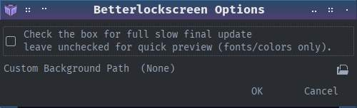
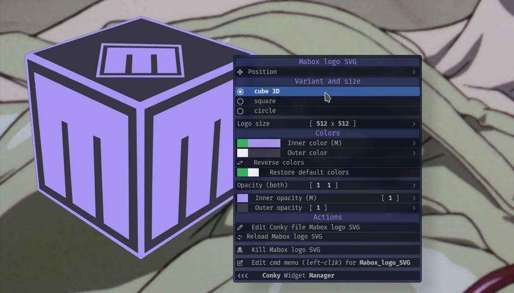

```
███╗   ███╗ █████╗ ██████╗  ██████╗ ██╗  ██╗
████╗ ████║██╔══██╗██╔══██╗██╔═══██╗╚██╗██╔╝
██╔████╔██║███████║██████╔╝██║   ██║ ╚███╔╝ 
██║╚██╔╝██║██╔══██║██╔══██╗██║   ██║ ██╔██╗ 
██║ ╚═╝ ██║██║  ██║██████╔╝╚██████╔╝██╔╝ ██╗
╚═╝     ╚═╝╚═╝  ╚═╝╚═════╝  ╚═════╝ ╚═╝  ╚═╝  Community.
```

# Betterlockscreen Theming – Mabox Linux Notes

This page covers Mabox-specific integration details.
For general usage see the main [README](README.md).

---

## Requirements

* `betterlockscreen` installed and set up for Mabox.

---

## Mabox Linux Integration

* Changing the desktop wallpaper updates the source image for
  betterlockscreen background regeneration (Default)

* Or use `Custom Background Path`. _Leave empty to use current wallpaper._



---

## Extra info – yad title image Mabox way

Mabox has a LOGO SVG Conky `Mabox_logo_SVG_mbcolor.conkyrc` where one can choose between 3 variations with coloring options.
The SVGs are created automatically when using the conky SVG coloring edit menu _(preview)_.

Path `$HOME/.icons/mabox-logo-*` is used to store the SVGs.

	In the scripts at the top, look for...

```
ICON="$HOME/.icons/mabox-logo-3d.svg"

# all options
mabox-logo-3d.svg
mabox-logo-circle.svg
mabox-logo-square.svg
```



---

## Mabox lock screen settings menu (jg)

Hotkey `W-A-l` opens the Mabox betterlockscreen settings for blur, etc.
