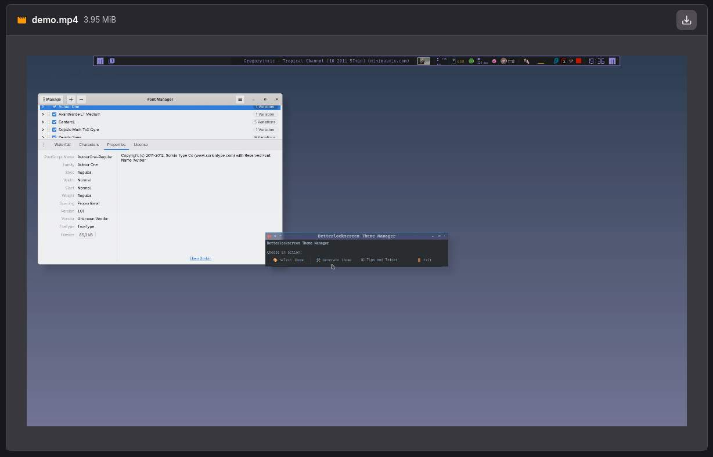
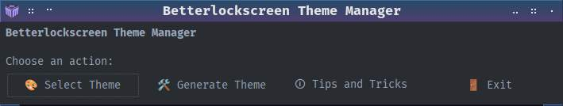
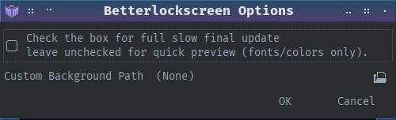
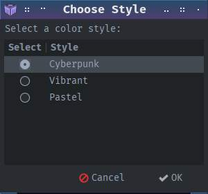
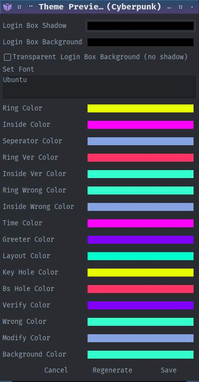
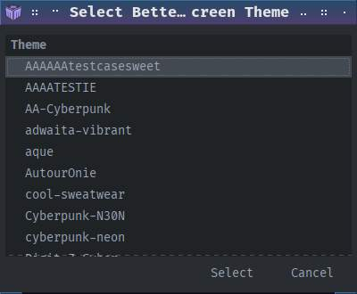
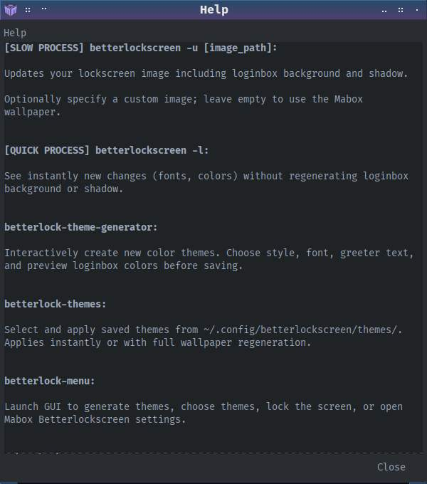
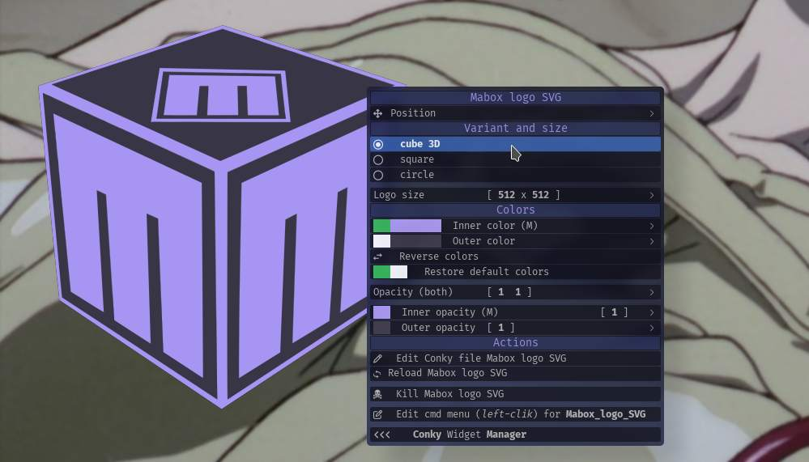

```
███╗   ███╗ █████╗ ██████╗  ██████╗ ██╗  ██╗
████╗ ████║██╔══██╗██╔══██╗██╔═══██╗╚██╗██╔╝
██╔████╔██║███████║██████╔╝██║   ██║ ╚███╔╝ 
██║╚██╔╝██║██╔══██║██╔══██╗██║   ██║ ██╔██╗ 
██║ ╚═╝ ██║██║  ██║██████╔╝╚██████╔╝██╔╝ ██╗
╚═╝     ╚═╝╚═╝  ╚═╝╚═════╝  ╚═════╝ ╚═╝  ╚═╝  Community.
```

# Betterlockscreen Theme Toolkit for Mabox Linux (pl, es, nl, en)


This toolkit offers intuitive scripts for creating, selecting, 
and applying custom Betterlockscreen themes—including Cyberpunk, 
Vibrant, and Pastel styles—on Mabox Linux. It allows easy customization of login, 
verification, and warning messages, and seamlessly integrates with the Mabox desktop wallpaper system.

Note: 
  * Need `betterlockscreen` installed and setup for Mabox.

---

# Quick Start...

## Launch ./`betterlock-theming.AppImage` 

  * Run **directly** via AppImage – no installation needed

#### Get started creating your first betterlockscreen theme:

```bash
chmod +x betterlock-theming.AppImage
./betterlock-theming.AppImage
```

---

#### Optional: To peek inside the AppImage:

```bash
./betterlock-theming.AppImage --appimage-extract
cd squashfs-root
ls
```

You’ll see all scripts, icons, and desktop files included.

---

_NOTE: The video need an update. Now we can add custom background during creating process._




# Manual Instalation Steps

## Bash scripts involved

1. **betterlock-theme-generator** – interactive color theme generator

2. **betterlock-themes** – select and activate existing themes

3. **betterlock-menu** – **main menu**

## Features

### 1. Theme Generator (`betterlock-theme-generator`)

* Choose a color style: **Cyberpunk**, **Vibrant**, or **Pastel**
* Randomly generate colors, with option to **regenerate until satisfied**
* Edit login, verification, and warning text
* Adjust login-box background or make it fully transparent
* Choose font family
* Preview all color variables
* Save themes directly to:

```
~/.config/betterlockscreen/themes/
```

Saved themes can then be selected using **betterlock-themes**.

### Login window demo's. 

_(fade effect is from picom)_


   


---

### 2. Theme Picker (`betterlock-themes`)

* Lists all saved themes in `~/.config/betterlockscreen/themes`
	_themes dir will be created_
* Activate a chosen theme
* Optionally regenerates login box background, shadows, and transparency
* Integrates with Mabox wallpaper handling _default_
* Or custom background image

---

### 3. Main Menu (`betterlock-menu`)

* Provides the main menu. a simple GUI interface (yad)
* Common actions:


  
---

## Save theme Quick or Slow ...

When applying or previewing themes:

* **Quick update (instant preview):**

  * Updates colors, fonts, and text immediately
  * Great for seeing changes without delay
  * Does **NOT** update login box background/transparency or shadows

* **Slow update (full regeneration):**

  * Updates colors, fonts, and text
  * Rengenerate mabox wallpaper as background (default)
  * Regenerates login box shadows, and transparency

---

## Mabox Linux Integration

* Changing the desktop wallpaper updates the source image for 
  betterlockscreen background regeneration (Default)

* Or use `Custom Background Path`. _Leave empty to use current wallpaper._



---

## Installation

1. Clone the repository:

```
git clone https://gitlab.com/muzlabz/betterlockscreen-theme-creator
cd betterlockscreen-theme-creator
```

2. Install the scripts:

```
chmod +x bin/betterlock-*
cp bin/betterlock-* ~/bin
```

## Usage

### Main menu

```
betterlock-menu
```

## Note

* Themes are saved as `.theme` files in:

```
~/.config/betterlockscreen/themes/
```


## .Desktop template

```
[Desktop Entry]
Name=Betterlock Theme 
Comment=Choose betterlockscreen theme
Exec=/path/to/betterlock-menu
Icon=system-lock-screen
Terminal=false
Type=Application
Categories=Settings;Utility;
```

## Windows overview

  
 

## Extra info yad title image Mabox way

Mabox has a LOGO SVG Conky `Mabox_logo_SVG_mbcolor.conkyrc` where one can choose between 3 variation with coloring options.
The svg's are created automatic when using conky svg coloring edit menu _(preview)_.

Path `$HOME/.icons/mabox-logo-*` is used to store the svg's.

	In the scripts at the top, look for...
	
```
ICON="$HOME/.icons/mabox-logo-3d.svg"

# all options
mabox-logo-3d.svg
mabox-logo-circle.svg
mabox-logo-square.svg
```



## Mabox lock screen settings menu (jg)

Hotkey `W-A-l` show Mabox betterlockscreen settings for blur, etc...


